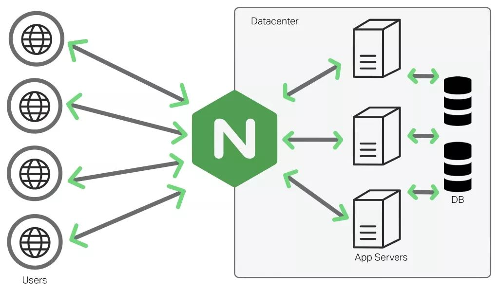

  <h1 align="center">Nginx 网关</h1>
  

    <a href="README.md"><strong>English</strong></a> | <strong>简体中文</strong>
  

## 目录

- [仓库简介](#项目介绍)
- [前置条件](#前置条件)
- [镜像说明](#镜像说明)
- [获取帮助](#获取帮助)
- [如何贡献](#如何贡献)

## 项目介绍
[Nginx](https://github.com/nginx/nginx) **Nginx** 是一款高性能的HTTP和反向代理服务器，轻量级、高并发，助力Web服务稳定高效运行。。

**Nginx 的核心特性**包括：

Nginx 的核心特性可概括为以下六大要点：

**1. 事件驱动架构**

• 采用异步非阻塞I/O模型（epoll/kqueue）

• 单线程可处理数万并发连接

• 资源占用极低（CPU/内存消耗少）

**2. 高性能代理**

• 支持HTTP/HTTPS/TCP/UDP反向代理

• 负载均衡算法（轮询/权重/IP哈希等）

• 动态服务发现集成能力

**3. 流量管理**

• 请求速率限制（leaky bucket算法）

• 并发连接数控制

• 智能流量路由与熔断

**4. 扩展性架构**

• 模块化设计（官方/第三方模块）

• 支持Lua脚本扩展（OpenResty）

• 热升级机制（服务不中断更新）

**5. Web服务优化**

• 静态文件高效处理（零拷贝技术）

• 支持HTTP/2、WebSocket

• Gzip压缩与缓存控制

**6. 高可靠性**

• 主从多进程架构

• 健康检查与自动故障转移

• 多年验证的稳定性（全球TOP100万网站41.6%使用率）

**这些特性使Nginx成为现代Web架构的核心组件，日均处理万亿级请求，是云计算/CDN/微服务的关键基础设施。**

本项目提供的开源镜像商品 [**`Nginx-监控和告警工具`**](https://marketplace.huaweicloud.com/hidden/contents/63cb0a15-4197-479c-8c24-8ef3c281276f#productid=OFFI1154255073536368640)，已预先安装 Nginx 软件及其相关运行环境，并提供部署模板。快来参照使用指南，轻松开启“开箱即用”的高效体验吧。

**架构设计：**

> **系统要求如下：**
> - CPU: 2vCPUs 或更高
> - RAM: 4GB 或更大
> - Disk: 至少 50GB

## 前置条件
[注册华为账号并开通华为云](https://support.huaweicloud.com/usermanual-account/account_id_001.html)

## 镜像说明

| 镜像规格                                                                                                                                              | 特性说明 | 备注 |
|---------------------------------------------------------------------------------------------------------------------------------------------------| --- | --- |
| [Nginx2.3.0-arm-v1.0](https://marketplace.huaweicloud.com/hidden/contents/63cb0a15-4197-479c-8c24-8ef3c281276f#productid=OFFI1154255073536368640) | 基于鲲鹏服务器 + Huawei Cloud EulerOS 2.0 64bit 安装部署 |  |

## 获取帮助
- 更多问题可通过 [issue](https://github.com/HuaweiCloudDeveloper/nginx-image/issues) 或 华为云云商店指定商品的服务支持 与我们取得联系
- 其他开源镜像可看 [open-source-image-repos](https://github.com/HuaweiCloudDeveloper/open-source-image-repos)

## 如何贡献
- Fork 此存储库并提交合并请求
- 基于您的开源镜像信息同步更新 README.md